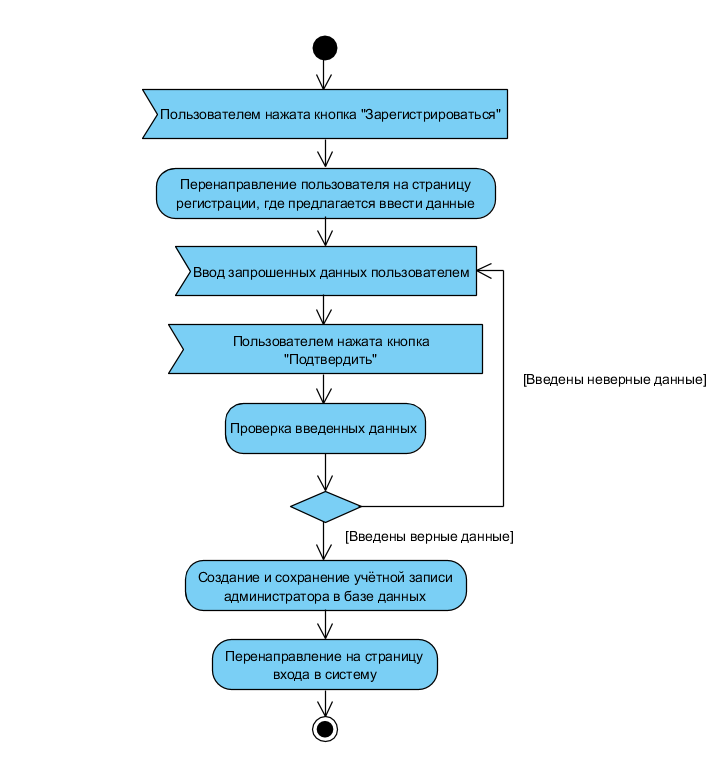
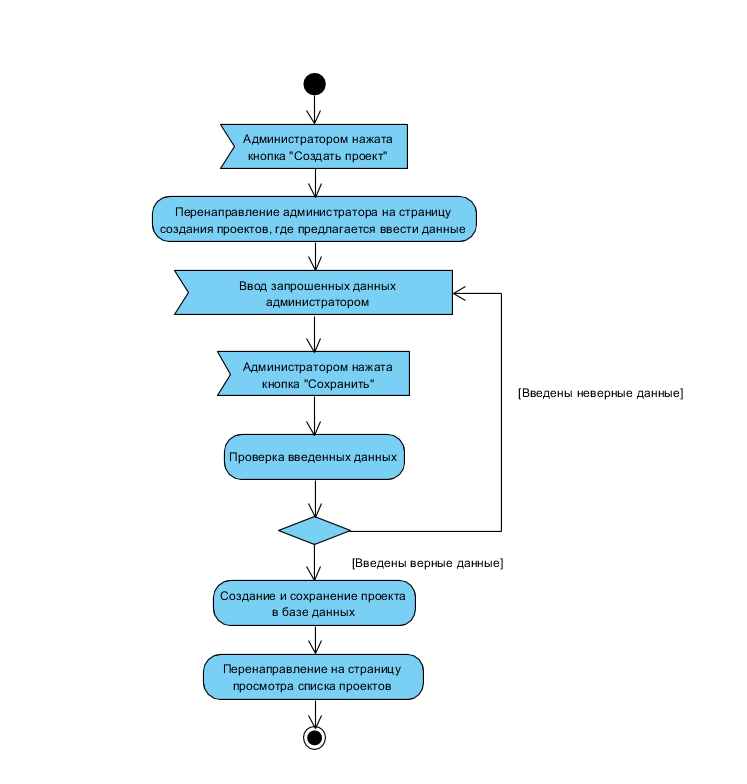
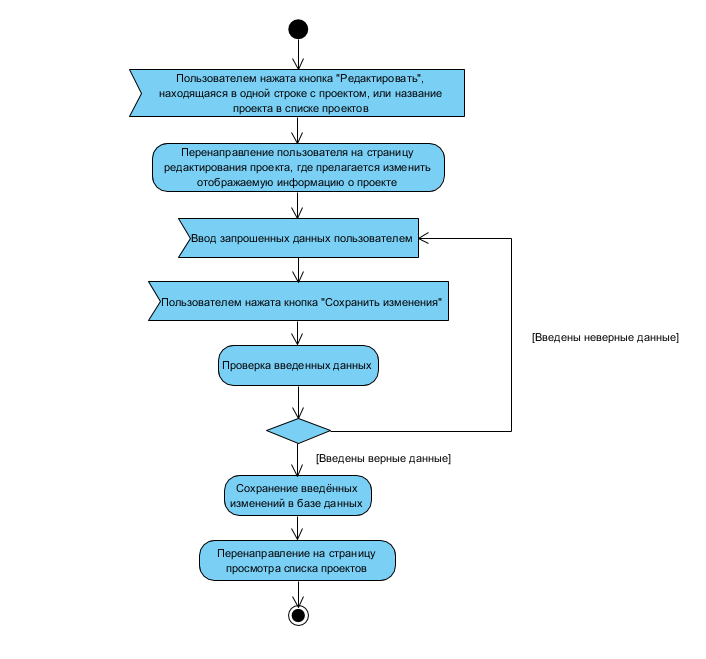
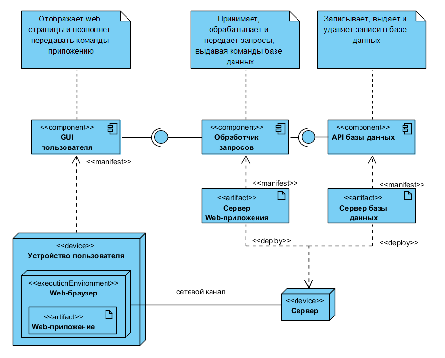

# Проектирование системы (UML диаграммы)

### Содержание

[Глоссарий](#0)  
1. [Диаграмма прецедентов](#1)    

&nbsp;&nbsp;1.1. [Описание актёров](#1.1)   
&nbsp;&nbsp;1.2. [Варианты использования](#1.2)  
&nbsp;&nbsp;&nbsp;&nbsp;1.2.1 [Зарегистрироваться в системе](#1.2.1)  
&nbsp;&nbsp;&nbsp;&nbsp;&nbsp;&nbsp;&nbsp;&nbsp;1.2.1.1 [Поток событий](#1.2.1.1)  
&nbsp;&nbsp;&nbsp;&nbsp;&nbsp;&nbsp;&nbsp;&nbsp;1.2.1.2 [Диаграмма активности](#1.2.1.2)  
&nbsp;&nbsp;&nbsp;&nbsp;1.2.2 [Управление информацией о проекте (CRUD)](#1.2.2)  
&nbsp;&nbsp;&nbsp;&nbsp;&nbsp;&nbsp;&nbsp;&nbsp;1.2.2.1 [(CREATE) Создать проект](#1.2.2.1)  
&nbsp;&nbsp;&nbsp;&nbsp;&nbsp;&nbsp;&nbsp;&nbsp;&nbsp;&nbsp;&nbsp;&nbsp;1.2.2.1.1 [Поток событий](#1.2.2.1.1)  
&nbsp;&nbsp;&nbsp;&nbsp;&nbsp;&nbsp;&nbsp;&nbsp;&nbsp;&nbsp;&nbsp;&nbsp;1.2.2.1.2 [Диаграмма активности](#1.2.2.1.2)  
&nbsp;&nbsp;&nbsp;&nbsp;&nbsp;&nbsp;&nbsp;&nbsp;1.2.2.2 [(READ) Просмотреть информацию о проекте](#1.2.2.2)  
&nbsp;&nbsp;&nbsp;&nbsp;&nbsp;&nbsp;&nbsp;&nbsp;&nbsp;&nbsp;&nbsp;&nbsp;1.2.2.2.1 [Поток событий](#1.2.2.2.1)  
&nbsp;&nbsp;&nbsp;&nbsp;&nbsp;&nbsp;&nbsp;&nbsp;&nbsp;&nbsp;&nbsp;&nbsp;1.2.2.2.2 [Диаграмма активности](#1.2.2.2.2)  
&nbsp;&nbsp;&nbsp;&nbsp;&nbsp;&nbsp;&nbsp;&nbsp;1.2.2.3 [(UPDATE) Редактировать информацию о проекте](#1.2.2.3)  
&nbsp;&nbsp;&nbsp;&nbsp;&nbsp;&nbsp;&nbsp;&nbsp;&nbsp;&nbsp;&nbsp;&nbsp;1.2.2.3.1 [Поток событий](#1.2.2.3.1)  
&nbsp;&nbsp;&nbsp;&nbsp;&nbsp;&nbsp;&nbsp;&nbsp;&nbsp;&nbsp;&nbsp;&nbsp;1.2.2.3.2 [Диаграмма активности](#1.2.2.3.2)  
&nbsp;&nbsp;&nbsp;&nbsp;&nbsp;&nbsp;&nbsp;&nbsp;1.2.2.4 [(DELETE) Удалить информацию о проекте](#1.2.2.4)  
&nbsp;&nbsp;&nbsp;&nbsp;&nbsp;&nbsp;&nbsp;&nbsp;&nbsp;&nbsp;&nbsp;&nbsp;1.2.2.4.1 [Поток событий](#1.2.2.4.1)  
&nbsp;&nbsp;&nbsp;&nbsp;&nbsp;&nbsp;&nbsp;&nbsp;&nbsp;&nbsp;&nbsp;&nbsp;1.2.2.4.2 [Диаграмма активности](#1.2.2.4.2)  
&nbsp;&nbsp;&nbsp;&nbsp;1.2.3. [Управление информацией об учётной записи участника проекта (CRUD)](#1.2.3) 
&nbsp;&nbsp;&nbsp;&nbsp;&nbsp;&nbsp;&nbsp;&nbsp;1.2.3.1. [(CREATE) Создать учётную запись участника проекта](#1.2.3.1) 
&nbsp;&nbsp;&nbsp;&nbsp;&nbsp;&nbsp;&nbsp;&nbsp;&nbsp;&nbsp;&nbsp;&nbsp;1.2.3.1.1 [Поток событий](#1.2.3.1.1)  
&nbsp;&nbsp;&nbsp;&nbsp;&nbsp;&nbsp;&nbsp;&nbsp;&nbsp;&nbsp;&nbsp;&nbsp;1.2.3.1.2 [Диаграмма активности](#1.2.3.1.2)  
&nbsp;&nbsp;&nbsp;&nbsp;&nbsp;&nbsp;&nbsp;&nbsp;1.2.3.2. [(READ) Посмотреть информацию об участнике проекта](#1.2.3.2) 
&nbsp;&nbsp;&nbsp;&nbsp;&nbsp;&nbsp;&nbsp;&nbsp;&nbsp;&nbsp;&nbsp;&nbsp;1.2.3.2.1 [Поток событий](#1.2.3.2.1)  
&nbsp;&nbsp;&nbsp;&nbsp;&nbsp;&nbsp;&nbsp;&nbsp;&nbsp;&nbsp;&nbsp;&nbsp;1.2.3.2.2 [Диаграмма активности](#1.2.3.2.2)  
&nbsp;&nbsp;&nbsp;&nbsp;&nbsp;&nbsp;&nbsp;&nbsp;1.2.3.3. [(UPDATE) Редактировать информацию об участнике проекта](#1.2.3.3) 
&nbsp;&nbsp;&nbsp;&nbsp;&nbsp;&nbsp;&nbsp;&nbsp;&nbsp;&nbsp;&nbsp;&nbsp;1.2.3.3.1 [Поток событий](#1.2.3.3.1)  
&nbsp;&nbsp;&nbsp;&nbsp;&nbsp;&nbsp;&nbsp;&nbsp;&nbsp;&nbsp;&nbsp;&nbsp;1.2.3.3.2 [Диаграмма активности](#1.2.3.3.2)  
&nbsp;&nbsp;&nbsp;&nbsp;&nbsp;&nbsp;&nbsp;&nbsp;1.2.3.4. [(DELETE) Удалить информацию об участнике проекта](#1.2.3.4) 
&nbsp;&nbsp;&nbsp;&nbsp;&nbsp;&nbsp;&nbsp;&nbsp;&nbsp;&nbsp;&nbsp;&nbsp;1.2.3.4.1 [Поток событий](#1.2.3.4.1)  
&nbsp;&nbsp;&nbsp;&nbsp;&nbsp;&nbsp;&nbsp;&nbsp;&nbsp;&nbsp;&nbsp;&nbsp;1.2.3.4.2 [Диаграмма активности](#1.2.3.4.2)  
&nbsp;&nbsp;&nbsp;&nbsp;&nbsp;&nbsp;&nbsp;&nbsp;1.2.3.5. [Добавить пользователя в проект](#1.2.3.5) 
&nbsp;&nbsp;&nbsp;&nbsp;&nbsp;&nbsp;&nbsp;&nbsp;&nbsp;&nbsp;&nbsp;&nbsp;1.2.3.5.1 [Поток событий](#1.2.3.5.1)  
&nbsp;&nbsp;&nbsp;&nbsp;&nbsp;&nbsp;&nbsp;&nbsp;&nbsp;&nbsp;&nbsp;&nbsp;1.2.3.5.2 [Диаграмма активности](#1.2.3.5.2)  
&nbsp;&nbsp;&nbsp;&nbsp;&nbsp;&nbsp;&nbsp;&nbsp;1.2.3.6. [Исключить пользователя из проекта](#1.2.3.6) 
&nbsp;&nbsp;&nbsp;&nbsp;&nbsp;&nbsp;&nbsp;&nbsp;&nbsp;&nbsp;&nbsp;&nbsp;1.2.3.6.1 [Поток событий](#1.2.3.6.1)  
&nbsp;&nbsp;&nbsp;&nbsp;&nbsp;&nbsp;&nbsp;&nbsp;&nbsp;&nbsp;&nbsp;&nbsp;1.2.3.6.2 [Диаграмма активности](#1.2.3.6.2)  
&nbsp;&nbsp;&nbsp;&nbsp;1.2.4. [Управление информацией о роли (CRD)](#1.2.4) 
&nbsp;&nbsp;&nbsp;&nbsp;&nbsp;&nbsp;&nbsp;&nbsp;1.2.4.1. [(CREATE) Создать роль](#1.2.4) 
&nbsp;&nbsp;&nbsp;&nbsp;&nbsp;&nbsp;&nbsp;&nbsp;&nbsp;&nbsp;&nbsp;&nbsp;1.2.4.1.1 [Поток событий](#1.2.4.1.1)  
&nbsp;&nbsp;&nbsp;&nbsp;&nbsp;&nbsp;&nbsp;&nbsp;&nbsp;&nbsp;&nbsp;&nbsp;1.2.4.1.2 [Диаграмма активности](#1.2.4.1.2)  
&nbsp;&nbsp;&nbsp;&nbsp;&nbsp;&nbsp;&nbsp;&nbsp;1.2.4.2. [(READ) Посмотреть информацию о роли](#1.2.4.2) 
&nbsp;&nbsp;&nbsp;&nbsp;&nbsp;&nbsp;&nbsp;&nbsp;&nbsp;&nbsp;&nbsp;&nbsp;1.2.4.2.1 [Поток событий](#1.2.4.2.1)  
&nbsp;&nbsp;&nbsp;&nbsp;&nbsp;&nbsp;&nbsp;&nbsp;&nbsp;&nbsp;&nbsp;&nbsp;1.2.4.2.2 [Диаграмма активности](#1.2.4.2.2)  
&nbsp;&nbsp;&nbsp;&nbsp;&nbsp;&nbsp;&nbsp;&nbsp;1.2.4.3. [(DELETE) Удалить информацию о роли](#1.2.4.3) 
&nbsp;&nbsp;&nbsp;&nbsp;&nbsp;&nbsp;&nbsp;&nbsp;&nbsp;&nbsp;&nbsp;&nbsp;1.2.4.3.1 [Поток событий](#1.2.4.3.1)  
&nbsp;&nbsp;&nbsp;&nbsp;&nbsp;&nbsp;&nbsp;&nbsp;&nbsp;&nbsp;&nbsp;&nbsp;1.2.4.3.2 [Диаграмма активности](#1.2.4.3.2)  
&nbsp;&nbsp;&nbsp;&nbsp;&nbsp;&nbsp;&nbsp;&nbsp;1.2.4.4. [Назначить роль участнику проекта](#1.2.4.4) 
&nbsp;&nbsp;&nbsp;&nbsp;&nbsp;&nbsp;&nbsp;&nbsp;&nbsp;&nbsp;&nbsp;&nbsp;1.2.4.4.1 [Поток событий](#1.2.4.4.1)  
&nbsp;&nbsp;&nbsp;&nbsp;&nbsp;&nbsp;&nbsp;&nbsp;&nbsp;&nbsp;&nbsp;&nbsp;1.2.4.4.2 [Диаграмма активности](#1.2.4.4.2)  
&nbsp;&nbsp;&nbsp;&nbsp;1.2.5. [Авторизоваться в системе](#1.2.5) 
&nbsp;&nbsp;&nbsp;&nbsp;&nbsp;&nbsp;&nbsp;&nbsp;1.2.5.1 [Поток событий](#1.2.5.1)  
&nbsp;&nbsp;&nbsp;&nbsp;&nbsp;&nbsp;&nbsp;&nbsp;1.2.5.2 [Диаграмма активности](#1.2.5.2)  
&nbsp;&nbsp;&nbsp;&nbsp;1.2.6. [Управление информацией о задаче (CRUD)](#1.2.6) 
&nbsp;&nbsp;&nbsp;&nbsp;&nbsp;&nbsp;&nbsp;&nbsp;1.2.6.1. [(CREATE) Создать задачу](#1.2.6.1) 
&nbsp;&nbsp;&nbsp;&nbsp;&nbsp;&nbsp;&nbsp;&nbsp;&nbsp;&nbsp;&nbsp;&nbsp;1.2.6.1.1 [Поток событий](#1.2.6.1.1)  
&nbsp;&nbsp;&nbsp;&nbsp;&nbsp;&nbsp;&nbsp;&nbsp;&nbsp;&nbsp;&nbsp;&nbsp;1.2.6.1.2 [Диаграмма активности](#1.2.6.1.2)  
&nbsp;&nbsp;&nbsp;&nbsp;&nbsp;&nbsp;&nbsp;&nbsp;1.2.6.2. [(READ) Посмотреть информацию о задаче](#1.2.6.2) 
&nbsp;&nbsp;&nbsp;&nbsp;&nbsp;&nbsp;&nbsp;&nbsp;&nbsp;&nbsp;&nbsp;&nbsp;1.2.6.2.1 [Поток событий](#1.2.6.2.1)  
&nbsp;&nbsp;&nbsp;&nbsp;&nbsp;&nbsp;&nbsp;&nbsp;&nbsp;&nbsp;&nbsp;&nbsp;1.2.6.2.2 [Диаграмма активности](#1.2.6.2.2)  
&nbsp;&nbsp;&nbsp;&nbsp;&nbsp;&nbsp;&nbsp;&nbsp;1.2.6.3. [(UPDATE) Редактировать информацию о задаче](#1.2.6.3) 
&nbsp;&nbsp;&nbsp;&nbsp;&nbsp;&nbsp;&nbsp;&nbsp;&nbsp;&nbsp;&nbsp;&nbsp;1.2.6.3.1 [Поток событий](#1.2.6.3.1)  
&nbsp;&nbsp;&nbsp;&nbsp;&nbsp;&nbsp;&nbsp;&nbsp;&nbsp;&nbsp;&nbsp;&nbsp;1.2.6.3.2 [Диаграмма активности](#1.2.6.3.2)  
&nbsp;&nbsp;&nbsp;&nbsp;&nbsp;&nbsp;&nbsp;&nbsp;1.2.6.4. [(DELETE) Удалить информацию о задаче](#1.2.6.4) 
&nbsp;&nbsp;&nbsp;&nbsp;&nbsp;&nbsp;&nbsp;&nbsp;&nbsp;&nbsp;&nbsp;&nbsp;1.2.6.4.1 [Поток событий](#1.2.6.4.1)  
&nbsp;&nbsp;&nbsp;&nbsp;&nbsp;&nbsp;&nbsp;&nbsp;&nbsp;&nbsp;&nbsp;&nbsp;1.2.6.4.2 [Диаграмма активности](#1.2.6.4.2)  
&nbsp;&nbsp;&nbsp;&nbsp;&nbsp;&nbsp;&nbsp;&nbsp;1.2.6.5. [Назначить задачу участнику проекта](#1.2.6.5) 
&nbsp;&nbsp;&nbsp;&nbsp;&nbsp;&nbsp;&nbsp;&nbsp;&nbsp;&nbsp;&nbsp;&nbsp;1.2.6.5.1 [Поток событий](#1.2.6.5.1)  
&nbsp;&nbsp;&nbsp;&nbsp;&nbsp;&nbsp;&nbsp;&nbsp;&nbsp;&nbsp;&nbsp;&nbsp;1.2.6.5.2 [Диаграмма активности](#1.2.6.5.2)  
&nbsp;&nbsp;&nbsp;&nbsp;1.2.7. [Управление информацией о встрече (CRUD)](#1.2.7) 
&nbsp;&nbsp;&nbsp;&nbsp;&nbsp;&nbsp;&nbsp;&nbsp;1.2.7.1. [(CREATE) Создать встречу](#1.2.7.1) 
&nbsp;&nbsp;&nbsp;&nbsp;&nbsp;&nbsp;&nbsp;&nbsp;&nbsp;&nbsp;&nbsp;&nbsp;1.2.7.1.1 [Поток событий](#1.2.7.1.1)  
&nbsp;&nbsp;&nbsp;&nbsp;&nbsp;&nbsp;&nbsp;&nbsp;&nbsp;&nbsp;&nbsp;&nbsp;1.2.7.1.2 [Диаграмма активности](#1.2.7.1.2)  
&nbsp;&nbsp;&nbsp;&nbsp;&nbsp;&nbsp;&nbsp;&nbsp;1.2.7.2. [(READ) Посмотреть информацию о встрече](#1.2.7.2) 
&nbsp;&nbsp;&nbsp;&nbsp;&nbsp;&nbsp;&nbsp;&nbsp;&nbsp;&nbsp;&nbsp;&nbsp;1.2.7.2.1 [Поток событий](#1.2.7.2.1)  
&nbsp;&nbsp;&nbsp;&nbsp;&nbsp;&nbsp;&nbsp;&nbsp;&nbsp;&nbsp;&nbsp;&nbsp;1.2.7.2.2 [Диаграмма активности](#1.2.7.2.2)  
&nbsp;&nbsp;&nbsp;&nbsp;&nbsp;&nbsp;&nbsp;&nbsp;1.2.7.3. [(UPDATE) Редактировать информацию о встрече](#1.2.7.3) 
&nbsp;&nbsp;&nbsp;&nbsp;&nbsp;&nbsp;&nbsp;&nbsp;&nbsp;&nbsp;&nbsp;&nbsp;1.2.7.3.1 [Поток событий](#1.2.7.3.1)  
&nbsp;&nbsp;&nbsp;&nbsp;&nbsp;&nbsp;&nbsp;&nbsp;&nbsp;&nbsp;&nbsp;&nbsp;1.2.7.3.2 [Диаграмма активности](#1.2.7.3.2)  
&nbsp;&nbsp;&nbsp;&nbsp;&nbsp;&nbsp;&nbsp;&nbsp;1.2.7.4. [(DELETE) Удалить информацию о встрече](#1.2.7.4) 
&nbsp;&nbsp;&nbsp;&nbsp;&nbsp;&nbsp;&nbsp;&nbsp;&nbsp;&nbsp;&nbsp;&nbsp;1.2.7.4.1 [Поток событий](#1.2.7.4.1)  
&nbsp;&nbsp;&nbsp;&nbsp;&nbsp;&nbsp;&nbsp;&nbsp;&nbsp;&nbsp;&nbsp;&nbsp;1.2.7.4.2 [Диаграмма активности](#1.2.7.4.2)  
&nbsp;&nbsp;&nbsp;&nbsp;1.2.8. [Выйти из системы](#1.2.8) 
&nbsp;&nbsp;&nbsp;&nbsp;&nbsp;&nbsp;&nbsp;&nbsp;1.2.8.1 [Поток событий](#1.2.8.1)  
&nbsp;&nbsp;&nbsp;&nbsp;&nbsp;&nbsp;&nbsp;&nbsp;1.2.8.2 [Диаграмма активности](#1.2.8.2)  

2. [Диаграммы последовательности](#2)  
&nbsp;&nbsp;2.1. [Обмен между приложение и сервером по протоколу HTTP](#2.1)  
3. [Диаграмма состояний](#3)  
4. [Диаграмма классов](#4)  
5. [Диаграмма развёртывания](#5)  

## Глоссарий 

| Термин | Описание |
|:---|:---|
| Администратор | Человек, использующий данное приложение для управления проектом по разработке программного обеспечения. |
| Участник проекта | Человек, использующий данное приложение под управлением администратора для организации работы по разработке программного обеспечения. |
| Информация об участнике проекта | Необходимые для идентификации данные об участнике проекта, включающие в себя псевдоним, имя и фамилию. |
| Роль | Данные, которые описывают ограничения действий участника проекта, которому определена данная роль. |
| Задача | Задание, относящееся к проекту, которое необходимо выполнить участнику проекта. |
| Информация о задаче | Предмет задачи, краткое описание того, что необходимо выполнить, статус задачи, информация о том, какому участнику проекта была назначени задача и сроки выполнения задачи. |
| Статус задачи | Задача может находится в одном из трёх статусов: New - задача была создана, но участник проекта, которому она назначена, ещё не приступил к выполнению; In Progress – задача была создана и участник проекта, которому она назначена приступил к выполнению, однако не завершил выполнение; Done – задача была создана и выполнена. |
| Встреча | Информация об очной встрече, содержащая место, дату и участников встречи. |
| Проект | Информация о разработке программного обеспечения с описанием участников проекта и отведенных им ролей. |
| Информация о проекте | Данные, включающие в себя название, краткое описание и список участников проекта, с отведенными им ролями. |

## 1\. Диаграмма прецедентов 

### 1.1\. Описание актёров 

| Актёр | Описание |
|:---|:---|
| Участник проекта | Пользователь, прошедший процесс авторизации в системе под своим именем или псевдонимом. Имеет полный доступ к пользовательскому функционалу системы: может создавать, редактировать и удалять задачи. |
| Администратор | Пользователь, прошедший процесс авторизации в системе под своим именем или псевдонимом. Имеет полный доступ к функционалу администратора системы: может создавать, редактировать, архивировать и удалять проекты, регистрировать пользователей, создавать, редактировать и удалять роли и их ограничения, а также создавать, редактировать и удалять категории задач.|

### 1.2\. Варианты использования 

#### 1.2.1\. Зарегистрироваться в системе 

##### 1.2.1.1\. Поток событий 

<b>Описание: </b> Вариант использования "Зарегистрироваться в приложении" позволяет создать пользователю собственную учётную запись администратора.

<b>Основной поток. </b>

1. Пользователь нажимает кнопку "Зарегистрироваться".
2. Приложение перенаправляет пользователя на страницу регистрации.
3. Приложение предлагает пользователю ввести следующие данные: псевдоним, настоящие имя и фамилию пользователя, адрес электронной почты и пароль. 
4. Пользователь вводит указанные данные.
5. Пользователь нажимает кнопку "Подтвердить".
6. Приложение проверяет введённые данные. Если уже создана учётная запись с таким псевдонимом, то выполняется альтернативный поток А1.
7. Приложение создаёт учётную запись администратора и сохраняет её в базе данных.
8. Приложение перенаправляет пользователя на страницу входа в систему.
9. Вариант использования завершён.

<b> Альтернативный поток А1 </b>

1. Приложение информирует пользователя, что уже создана учётная запись с таким псевдонимом.
2. Начинается выполнение пункта 3 основного потока.

##### 1.2.1.2\. Диаграмма активности 

#### 1.2.2\. Управление информацией о проекте (CRUD) 

##### 1.2.2.1\. (CREATE) Создать проект 

###### 1.2.2.1.1\. Поток событий 

<b>Описание: </b> Вариант использования "Создать проект" позволяет пользователю создать проект.

<b>Предусловия: </b> Пользователь, авторизировавшийся в системе как администратор, находится на странице просмотра списка проектов.

<b>Основной поток. </b>

1. Администратор нажимает кнопку "Создать проект".
2. Приложение перенаправляет администратора на страницу создания проектов.
3. Приложение предлагает администратору ввести следующие данные: название и описание проекта, а также выбрать участников проекта из списка зарегистрированных пользователей, поставив им в соответствие роли.
4. Администратор вводит указанные данные.
5. Администратор нажимает "Сохранить".
6. Приложение проверяет введённые данные. Если уже создан проект с таким названием, то выполняется альтернативный поток А1.
7. Приложение создаёт проект и сохраняет его в базе данных.
8. Приложение перенаправляет администратора на страницу просмотра списка проектов.
9. Вариант использования завершён.

<b> Альтернативный поток А1 </b>

1. Приложение информирует администратора, что уже создан проект с таким названием.
2. Начинается выполнение пункта 3 основного потока.

###### 1.2.2.1.2\. Диаграмма активности 

		
##### 1.2.2.2\. (READ) Просмотреть информацию о проекте 

###### 1.2.2.2.1\. Поток событий 

<b>Описание: </b> Вариант использования "Просмотреть информацию о проекте" позволяет пользователю посмотреть информацию о проекте.

<b>Предусловия: </b> Пользователь, авторизировавшийся в системе, находится на странице просмотра списка проектов.

<b>Основной поток. </b>

1. Пользователь нажимает кнопку "Посмотреть", находящуюся в одной строке с проектом, или на название проекта в списке проектов.
2. Приложение перенаправляет пользователя на страницу просмотра информации о проекте.
3. Вариант использования завершён.

###### 1.2.2.2.2\. Диаграмма активности 

##### 1.2.2.3\. (UPDATE) Редактировать информацию о проекте 

###### 1.2.2.3.1\. Поток событий 

<b>Описание: </b> Вариант использования "Редактировать информацию о проекте" позволяет пользователю редактировать информацию о проекте.

<b>Предусловия: </b> Пользователь, авторизировавшийся в системе, находится на странице просмотра списка проектов.

<b>Основной поток. </b>

1. Пользователь нажимает кнопку "Редактировать", находящуюся в одной строке с проектом, или на название проекта в списке проектов.
2. Приложение перенаправляет пользователя на страницу редактирования проектов.
3. Приложение отображает информацию о проекте.
4. Приложение предлагает пользователю изменить следующие данные: название и описание проекта, а также выбрать участников проекта из списка зарегистрированных пользователей, поставив им в соответствие роли.
5. Пользователь вводит данные.
6. Пользователь нажимает "Сохранить изменения".
7. Приложение проверяет введённые данные. Если уже существует проект с таким названием, то выполняется альтернативный поток А1.
8. Приложение сохраняет введенные изменения в базе данных.
9. Приложение перенаправляет пользователя на страницу просмотра списка проектов.
10. Вариант использования завершён.

<b> Альтернативный поток А1 </b>

1. Приложение информирует пользователя, что проект с таким названием уже существуюет.
2. Начинается выполнение пункта 3 основного потока.

###### 1.2.2.3.2\. Диаграмма активности 

##### 1.2.2.4\. (DELETE) Удалить информацию о проекте 

###### 1.2.2.4.1\. Поток событий 

<b>Описание: </b> Вариант использования "Удалить информацию о проекте" позволяет пользователю удалить информацию о проекте.

<b>Предусловия: </b> Пользователь, авторизировавшийся в системе как администратор, находится на странице просмотра списка проектов.

<b>Основной поток. </b>

1. Администратор нажимает кнопку "Удалить", находящуюся в одной строке с проектом, или, выбрав несколько проектов, нажимает кнопку "Удалить", находящуюся над списком проектов.
2. Приложение исключает пользователей из выбраных проектов.
3. Приложение удаляет задачи, связанные с данными проектами, из базы данных.
4. Приложение удаляет встречи, связанные с данными проектами, из базы данных.
5. Приложение удаляет информацию о выбранных проектах из базы данных.
6. Приложение отображает страницу просмотра списка проектов с учётом изменений в базе данных.
7. Вариант использования завершён.

###### 1.2.2.4.2\. Диаграмма активности 

#### 1.2.3\. Управление информацией об учётной записи участника проекта (CRUD) 

##### 1.2.3.1\. (CREATE) Создать учётную запись участника проекта 

###### 1.2.3.1.1\. Поток событий 

<b>Описание: </b> Вариант использования "Создать учётную запись участника проекта" позволяет пользователю cоздать учётную запись пользователя.

<b>Предусловия: </b> Пользователь, авторизировавшийся в системе как администратор, находится на странице просмотра списка учётных записей пользователей.

<b>Основной поток. </b>

1. Пользователь нажимает кнопку "Создать учётную запись".
2. Приложение перенаправляет пользователя на страницу создания учётных записей пользователя.
3. Приложение предлагает пользователю ввести следующие данные: псевдоним, настоящие имя и фамилию, а также e-mail и пароль нового пользователя.
4. Пользователь вводит указанные данные.
5. Пользователь нажимает "Создать".
6. Приложение проверяет введённые данные. Если уже создан пользователь с таким псевдонимом, то выполняется альтернативный поток А1.
7. Приложение создаёт учётную запись пользователя и сохраняет её в базе данных.
8. Приложение перенаправляет пользователя на страницу просмотра списка учётных записей пользователей.
9. Вариант использования завершён.

<b> Альтернативный поток А1 </b>

1. Приложение информирует пользователя, что пользователь с таким псевдонимом уже существует.
2. Начинается выполнение пункта 3 основного потока.

###### 1.2.3.1.2\. Диаграмма активности 

##### 1.2.3.2\. (READ) Посмотреть информацию об участнике проекта 

###### 1.2.3.2.1\. Поток событий 

<b>Описание: </b> Вариант использования "Посмотреть информацию об участнике проекта" позволяет пользователю посмотреть информацию об участнике проект.

<b>Предусловия: </b> Пользователь, авторизировавшийся в системе как администратор, находится на странице просмотра списка учётных записей пользователей.

<b>Основной поток. </b>

1. Пользователь нажимает кнопку "Посмотреть", находящуюся в одной строке с учётной записью пользователя, или на псевдоним пользователя в списке учётных записей пользователей.
2. Приложение перенаправляет пользователя на страницу просмотра информации об учётной записи пользователя.
3. Вариант использования завершён.

###### 1.2.3.2.2\. Диаграмма активности 

##### 1.2.3.3\. (UPDATE) Редактировать информацию об участнике проекта 

###### 1.2.3.3.1\. Поток событий 

<b>Описание: </b> Вариант использования "Редактировать информацию об участнике проекта" позволяет пользователю редактировать информацию об участнике проекта.

<b>Предусловия: </b> Пользователь, авторизировавшийся в системе как администратор, находится на странице просмотра списка учётных записей пользователей.

<b>Основной поток. </b>

1. Пользователь нажимает кнопку "Редактировать", находящуюся в одной строке с учётной записью пользователя, или на псевдоним пользователя в списке учётных записей пользователей.
2. Приложение перенаправляет пользователя на страницу редактирования учётной записи пользователя.
3. Приложение отображает информацию об учётной записи пользователя.
4. Приложение предлагает пользователю изменить следующие данные: псевдоним, настоящие имя и фамилию, а также e-mail и пароль пользователя.
5. Пользователь вводит данные.
6. Пользователь нажимает "Сохранить изменения".
7. Приложение проверяет введённые данные. Если уже существует пользователь с таким псевдонимом, то выполняется альтернативный поток А1.
8. Приложение сохраняет введенные изменения в базе данных.
9. Приложение перенаправляет пользователя на страницу просмотра списка учётных записей пользователя.
10. Вариант использования завершён.

<b> Альтернативный поток А1 </b>

1. Приложение информирует пользователя, что пользователь с таким псевдонимом уже существуюет.
2. Начинается выполнение пункта 3 основного потока.

###### 1.2.3.3.2\. Диаграмма активности 

##### 1.2.3.4\. (DELETE) Удалить информацию об участнике проекта 

###### 1.2.3.4.1\. Поток событий 

<b>Описание: </b> Вариант использования "Удалить информацию об участнике проекта" позволяет пользователю удалить информацию об участнике проекта.

<b>Предусловия: </b> Пользователь, авторизировавшийся в системе как администратор, находится на странице просмотра списка учётных записей пользователей.

<b>Основной поток. </b>

1. Пользователь нажимает кнопку "Удалить", находящуюся в одной строке с учётной записью, или, выбрав несколько учётных записей, нажимает кнопку "Удалить", находящуюся над списком учётных записей пользователей.
2. Приложение удаляет информацию о выбранных учётных записях из базы данных.
3. Приложение отображает страницу просмотра списка учётных записей с учётом изменений в базе данных.
4. Вариант использования завершён.

###### 1.2.3.4.2\. Диаграмма активности 

##### 1.2.3.5\. Добавить пользователя в проект 

###### 1.2.3.5.1\. Поток событий 

<b>Описание: </b> Вариант использования "Добавить пользователя в проект" позволяет администратору добавить пользователя в проект.

<b>Предусловия: </b> Пользователь, авторизировавшийся в системе как администратор, находится на странице просмотра или редактирования информации о проекте.

<b>Основной поток. </b>

1. Администратор ставит в соответствие пользователю роль из выпадающего списка, находящегося напротив псевдонима пользователя.
2. Администратор нажимает кнопку "Добавить в проект", находящуюся напротив псевдонима пользователя.
3. Приложение сохраняет введенные изменения в базе данных.
4. Вариант использования завершён.

###### 1.2.3.5.2\. Диаграмма активности 

##### 1.2.3.6\. Исключить пользователя из проекта 

###### 1.2.3.6.1\. Поток событий 

<b>Описание: </b> Вариант использования "Исключить пользователя из проекта" позволяет администратору исключить пользователя из проекта.

<b>Предусловия: </b> Пользователь, авторизировавшийся в системе как администратор, находится на странице просмотра или редактирования информации о проекте.

<b>Основной поток. </b>

1. Администратор нажимает кнопку "Исключить из проекта", находящуюся напротив псевдонима пользователя, или, выбрав несколько учётых записей, нажимает кнопку "Исключить", находящуюся над списком учётных записей.
2. Приложение сохраняет введенные изменения в базе данных.
3. Вариант использования завершён.

###### 1.2.3.6.2\. Диаграмма активности 

#### 1.2.4\. Управление информацией о роли (CRD) 

##### 1.2.4.1\. (CREATE) Создать роль 

###### 1.2.4.1.1\. Поток событий 

<b>Описание: </b> Вариант использования "Создать роль" позволяет пользователю создать роль.

<b>Предусловия: </b> Пользователь, авторизировавшийся в системе как администратор, находится на странице просмотра списка ролей.

<b>Основной поток. </b>

1. Пользователь нажимает кнопку "Создать роль".
2. Приложение перенаправляет пользователя на страницу создания роли.
3. Приложение предлагает пользователю ввести наименование и отметить возможности, предоставляемые данной ролью, такие как: редактировать проект, добавлять, редактировать и удалять задачи с указанием того, каким ролям могут быть назначены эти задачи.
4. Пользователь вводит указанные данные.
5. Пользователь нажимает "Создать".
6. Приложение проверяет введённые данные. Если уже создана роль с таким наименованием, то выполняется альтернативный поток А1.
7. Приложение создаёт роль и сохраняет её в базе данных.
8. Приложение перенаправляет пользователя на страницу просмотра списка ролей.
9. Вариант использования завершён.

<b> Альтернативный поток А1 </b>

1. Приложение информирует пользователя, что роль с таким наименованием уже существует.
2. Начинается выполнение пункта 3 основного потока.

###### 1.2.4.1.2\. Диаграмма активности 

##### 1.2.4.2\. (READ) Посмотреть информацию о роли 

###### 1.2.4.2.1\. Поток событий 

<b>Описание: </b> Вариант использования "Посмотреть информацию о роли" позволяет пользователю посмотреть информацию о роли.

<b>Предусловия: </b> Пользователь, авторизировавшийся в системе, находится на странице просмотра ролей.

<b>Основной поток. </b>

1. Пользователь нажимает кнопку "Посмотреть", находящуюся в одной строке с ролью, или на наименование роли в списке ролей.
2. Приложение перенаправляет пользователя на страницу просмотра информации о роли.
3. Вариант использования завершён.

###### 1.2.4.2.2\. Диаграмма активности 

##### 1.2.4.3\. (DELETE) Удалить информацию о роли 

###### 1.2.4.3.1\. Поток событий 

<b>Описание: </b> Вариант использования "Удалить роль" позволяет пользователю удалить информацию о роли.

<b>Предусловия: </b> Пользователь, авторизировавшийся в системе как администратор, находится на странице просмотра списка ролей.

<b>Основной поток. </b>

1. Пользователь нажимает кнопку "Удалить", находящуюся в одной строке с ролью, или, выбрав несколько ролей, нажимает кнопку "Удалить", находящуюся над списком ролей.
2. Приложение удаляет информацию о выбранных ролях из базы данных.
3. Приложение отображает страницу просмотра списка ролей с учётом изменений в базе данных.
4. Вариант использования завершён.

###### 1.2.4.3.2\. Диаграмма активности 

##### 1.2.4.4\. Назначить роль участнику проекта 

###### 1.2.4.4.1\. Поток событий 

<b>Описание: </b> Вариант использования "Назначить роль участнику проекта" позволяет администратору назначить роль участнику проекта.

<b>Предусловия: </b> Пользователь, авторизировавшийся в системе как администратор, находится на странице просмотра или редактирования информации о проекте.

<b>Основной поток. </b>

1. Администратор из выпадающего списка, содержащего наименование существующих ролей и находящегося напротив псевдонима пользователя, выбирает роль.
2. Администратор нажимает кнопку "Cохранить".
3. Приложение сохраняет введенные изменения в базе данных.
4. Вариант использования завершён.

###### 1.2.4.4.2\. Диаграмма активности 

#### 1.2.5\. Авторизоваться в системе 

##### 1.2.5.1\. Поток событий 

<b>Описание: </b> Вариант использования "Авторизоваться в системе" позволяет войти в систему.

<b>Предусловия: </b> Пользователь находится на странице входа в систему.

<b>Основной поток. </b>

1. Приложение предлагает пользователю ввести псевдоним и пароль. 
2. Пользователь вводит указанные данные.
3. Пользователь нажимает кнопку "Войти".
4. Приложение проверяет введённые данные. Если были введены неверные псевдоним и (или) пароль, то выполняется альтернативный поток А1.
5. Приложение перенаправляет пользователя на главную страницу системы.
6. Вариант использования завершён.

<b> Альтернативный поток А1 </b>

1. Приложение информирует пользователя, что введены некорректные данные.
2. Начинается выполнение пункта 1 основного потока.

##### 1.2.5.2\. Диаграмма активности 

#### 1.2.6\. Управление информацией о задаче (CRUD) 

##### 1.2.6.1\. (CREATE) Создать задачу 

###### 1.2.6.1.1\. Поток событий 

<b>Описание: </b> Вариант использования "Создать задачу" позволяет пользователю cоздать задачу.

<b>Предусловия: </b> Пользователь, авторизировавшийся в системе как участник проекта, находится на странице просмотра списка задач.

<b>Основной поток. </b>

1. Пользователь нажимает кнопку "Создать задачу".
2. Приложение перенаправляет пользователя на страницу создания задачи.
3. Приложение предлагает пользователю ввести следующие данные: метку, предмет, краткое описание, статус, приоритет и кому назначена задача.
4. Пользователь вводит указанные данные.
5. Пользователь нажимает "Создать".
7. Приложение создаёт задачу и сохраняет её в базе данных.
8. Приложение перенаправляет пользователя на страницу просмотра списка задач.
9. Вариант использования завершён.

###### 1.2.6.1.2\. Диаграмма активности 

##### 1.2.6.2\. (READ) Посмотреть информацию о задаче 

###### 1.2.6.2.1\. Поток событий 

<b>Описание: </b> Вариант использования "Посмотреть информацию о задаче" позволяет пользователю посмотреть информацию о задаче.

<b>Предусловия: </b> Пользователь, авторизировавшийся в системе как участник проекта, находится на странице просмотра списка задач.

<b>Основной поток. </b>

1. Пользователь нажимает кнопку "Посмотреть", находящуюся в одной строке с задачей, или на предмет задачи в списке задач.
2. Приложение перенаправляет пользователя на страницу просмотра информации о задаче.
3. Вариант использования завершён.

###### 1.2.6.2.2\. Диаграмма активности 

##### 1.2.6.3\. (UPDATE) Редактировать информацию о задаче 

###### 1.2.6.3.1\. Поток событий 

<b>Описание: </b> Вариант использования "Редактировать информацию о задаче" позволяет пользователю редактировать информацию о задаче.

<b>Предусловия: </b> Пользователь, авторизировавшийся в системе как участник проекта, находится на странице просмотра списка задач.

<b>Основной поток. </b>

1. Пользователь нажимает кнопку "Редактировать", находящуюся в одной строке с задачей, или на предмет задачи в списке задач.
2. Приложение перенаправляет пользователя на страницу редактирования задачи.
3. Приложение отображает информацию о задаче.
4. Приложение предлагает пользователю изменить следующие данные: метку, предмет, краткое описание, статус, приоритет и кому назначена задача, а также начало, конец и процент выполнения задачи.
5. Пользователь вводит данные.
6. Пользователь нажимает "Сохранить изменения".
7. Приложение сохраняет введенные изменения в базе данных.
8. Приложение перенаправляет пользователя на страницу просмотра списка задач.
9. Вариант использования завершён.

###### 1.2.6.3.2\. Диаграмма активности 

##### 1.2.6.4\. (DELETE) Удалить информацию о задаче 

###### 1.2.6.4.1\. Поток событий 

<b>Описание: </b> Вариант использования "Удалить информацию о задаче" позволяет пользователю удалить информацию о задаче.

<b>Предусловия: </b> Пользователь, авторизировавшийся в системе как участник проекта, находится на странице просмотра списка задач.

<b>Основной поток. </b>

1. Пользователь нажимает кнопку "Удалить", находящуюся в одной строке с задачей, или, выбрав несколько задач, нажимает кнопку "Удалить", находящуюся над списком задач.
2. Приложение удаляет информацию о выбранных задачах из базы данных.
3. Приложение отображает страницу просмотра списка задач с учётом изменений в базе данных.
4. Вариант использования завершён.

###### 1.2.6.4.2\. Диаграмма активности 

##### 1.2.6.5\. Назначить задачу участнику проекта 

###### 1.2.6.5.1\. Поток событий 

<b>Описание: </b> Вариант использования "Назначить задачу участнику проекта" позволяет пользователю назначить задачу участнику проекта.

<b>Предусловия: </b> Пользователь, авторизировавшийся в системе как участник проекта, находится на странице просмотра или редактирования информации о задаче.

<b>Основной поток. </b>

1. Пользователь из выпадающего списка, содержащего псевдонимы пользователей, состоящих в проекте, выбирает участника проекта.
2. Пользователь нажимает кнопку "Cохранить".
3. Приложение сохраняет введенные изменения в базе данных.
4. Вариант использования завершён.

###### 1.2.6.5.2\. Диаграмма активности 

#### 1.2.7\. Управление информацией о встрече (CRUD) 

##### 1.2.7.1\. (CREATE) Создать встречу 

###### 1.2.7.1.1\. Поток событий 

<b>Описание: </b> Вариант использования "Создать встречу" позволяет пользователю cоздать встречу.

<b>Предусловия: </b> Пользователь, авторизировавшийся в системе как участник проекта, находится на странице просмотра списка встреч.

<b>Основной поток. </b>

1. Пользователь нажимает кнопку "Создать встречу".
2. Приложение перенаправляет пользователя на страницу создания встречи.
3. Приложение предлагает пользователю ввести предмет, место, время встречи и выбрать участников встречи, из состоящих в проекте пользователей.
4. Пользователь вводит указанные данные.
5. Пользователь нажимает "Создать".
7. Приложение создаёт встречу и сохраняет её в базе данных.
8. Приложение перенаправляет пользователя на страницу просмотра списка встреч.
9. Вариант использования завершён.

###### 1.2.7.1.2\. Диаграмма активности 

##### 1.2.7.2\. (READ) Посмотреть информацию о встрече 

###### 1.2.7.2.1\. Поток событий 

<b>Описание: </b> Вариант использования "Посмотреть информацию о встрече" позволяет пользователю посмотреть информацию о встрече.

<b>Предусловия: </b> Пользователь, авторизировавшийся в системе как участник проекта, находится на странице просмотра списка встреч.

<b>Основной поток. </b>

1. Пользователь нажимает кнопку "Посмотреть", находящуюся в одной строке со встречей, или на предмет встречи в списке встреч.
2. Приложение перенаправляет пользователя на страницу просмотра информации о встрече.
3. Вариант использования завершён.

###### 1.2.7.2.2\. Диаграмма активности 

##### 1.2.7.3\. (UPDATE) Редактировать информацию о встрече 

###### 1.2.7.3.1\. Поток событий 

<b>Описание: </b> Вариант использования "Редактировать информацию о встрече" позволяет пользователю редактировать информацию о встрече.

<b>Предусловия: </b> Пользователь, авторизировавшийся в системе как участник проекта, находится на странице просмотра списка встреч.

<b>Основной поток. </b>

1. Пользователь нажимает кнопку "Редактировать", находящуюся в одной строке со встречей, или на предмет встречи в списке встреч.
2. Приложение перенаправляет пользователя на страницу редактирования встречи.
3. Приложение отображает информацию о встрече.
4. Приложение предлагает пользователю ввести предмет, место, время встречи и выбрать участников встречи, из состоящих в проекте пользователей.
5. Пользователь вводит данные.
6. Пользователь нажимает "Сохранить изменения".
7. Приложение сохраняет введенные изменения в базе данных.
8. Приложение перенаправляет пользователя на страницу просмотра списка встреч.
9. Вариант использования завершён.

###### 1.2.7.3.2\. Диаграмма активности 

##### 1.2.7.4\. (DELETE) Удалить информацию о встрече 

###### 1.2.7.4.1\. Поток событий 

<b>Описание: </b> Вариант использования "Удалить информацию о встрече" позволяет пользователю удалить информацию о встрече.

<b>Предусловия: </b> Пользователь, авторизировавшийся в системе как участник проекта, находится на странице просмотра списка встреч.

<b>Основной поток. </b>

1. Пользователь нажимает кнопку "Удалить", находящуюся в одной строке со встречей, или, выбрав несколько встреч, нажимает кнопку "Удалить", находящуюся над списком встреч.
2. Приложение удаляет информацию о выбранных встречах из базы данных.
3. Приложение отображает страницу просмотра списка встреч с учётом изменений в базе данных.
4. Вариант использования завершён.

###### 1.2.7.4.2\. Диаграмма активности 

#### 1.2.8\. Выйти из системы 

##### 1.2.8.1\. Поток событий 

<b>Описание: </b> Вариант использования "Выйти из системы" позволяет пользователю выйти из системы.

<b>Предусловия: </b> Пользователь должен быть авторизирован в системе.

<b>Основной поток. </b>

1. Пользователь нажимает кнопку "Выйти".
2. Приложение перенаправляет пользователя на страницу входа в систему.
4. Вариант использования завершён.

##### 1.2.8.2\. Диаграмма активности 

## 2\. Диаграммы последовательности 

### 2.1\. Обмен между приложение и сервером по протоколу HTTP 

## 3\. Диаграмма состояний 

## 4\. Диаграмма классов 

## 5\. Диаграмма развёртывания 

